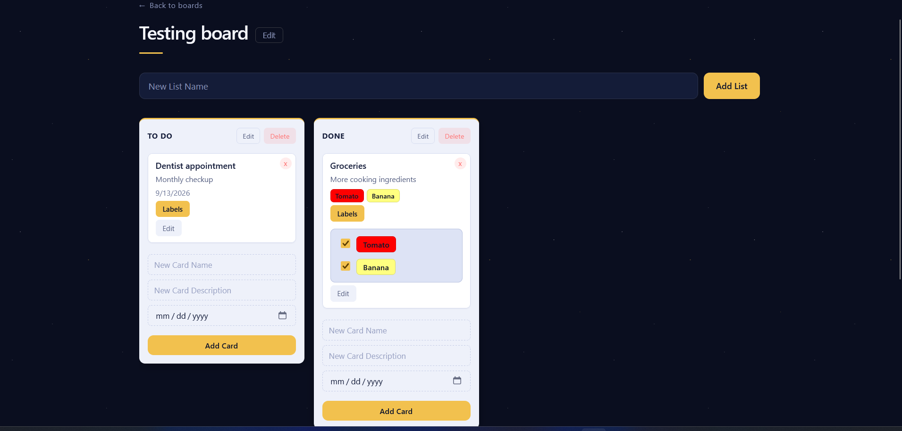

# Task Manager

A collaborative task manager built with a Flask API and a React frontend. Organize work into boards, columns (lists), and cards, with reusable colored labels that can be attached to any card.



## Features

- **Boards** — create, rename, and delete top-level project containers
- **Lists** — columns within a board (such as "To Do", "In Progress", "Done")
- **Cards** — tasks within a list, with an optional description and due date
- **Labels** — reusable colored tags, managed globally and attachable to any card via many-to-many relationship
- Full CRUD on every entity, with inline editing throughout the UI

## Tech Stack

**Backend**
- Python 3 / Flask
- SQLAlchemy 2.0 (declarative `Mapped` / `mapped_column` syntax)
- PostgreSQL
- Flask-CORS

**Frontend**
- React 19 (Vite)
- React Router
- Plain CSS (custom properties, no framework)

## Getting Started

### Prerequisites

- Python 3.10+
- Node.js 18+
- PostgreSQL 14+

### Backend setup

```bash
# From the project root
pip install flask flask-sqlalchemy flask-cors psycopg2-binary python-dotenv

# Create the database (if createdb fails with a password/user error, try createdb -U postgres task_manager)
createdb task_manager 

# Configure your connection string
cp .env.example .env
# then edit .env with your actual PostgreSQL credentials to avoid leaking your database password
```

Create the schema (tables are not auto-generated on startup):

```bash
python init_db.py
```

Run the API:

```bash
python run.py
```

The API will be available at `http://127.0.0.1:5000`.

### Frontend setup

```bash
cd frontend
npm install
npm run dev
```

The app will be available at `http://localhost:5173`.

## TO-DO

- Drag-and-drop reordering (the `position` column exists on lists and cards but is not yet used)
- Batch endpoint to return cards with their labels, replacing the current per-card fetch